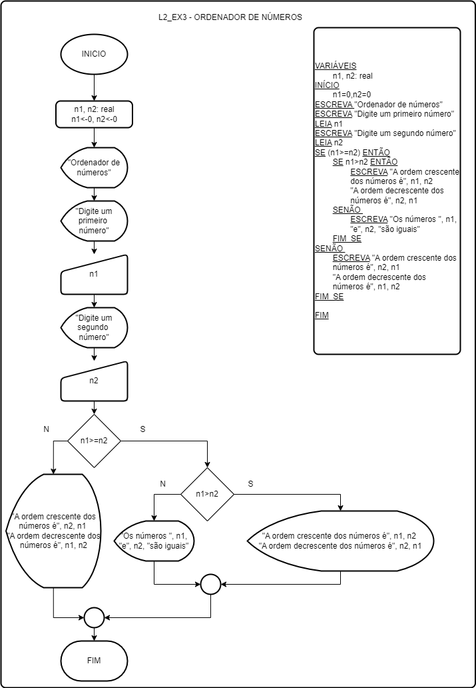

Algoritmo de ordenação de dois números em C++ utilizando apenas ferramentas como estruturas de decisão IF.

graph TD;
    Start((Inicio)) --> A((Entrada de n1));
    A --> B{n1>=n2};
    B -- sim --> C{ n1>n2 };
    C -- sim --> D((Saída de n1 e n2 em ordem crescente e decrescente));
    D --> End((Fim));
    C -- não --> E((Saída de n1 e n2 são iguais));
    E --> End;
    B -- não --> F((Saída de n1 e n2 em ordem crescente e decrescente));
    F --> End;
