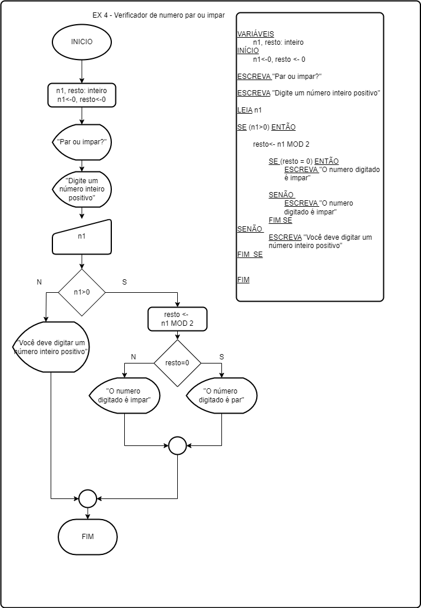

Algoritmo de verificação de par ou ímpar em C++ utilizando apenas ferramentas como estruturas de decisão IF.

graph TD;
    INICIO[INICIO] --> "Par ou impar?"["Par ou impar?"];
    "Par ou impar?" --> "Digite um número inteiro positivo"["Digite um número inteiro positivo"];
    "Digite um número inteiro positivo" --> n1["n1"];
    n1 --> |"n1, resto: inteiro"| "n1, resto: inteiro";
    "n1, resto: inteiro" --> |"n1, resto <- 0"| "n1, resto <- 0";
    "n1, resto <- 0" --> "Par ou impar?"["Par ou impar?"];
    "n1, resto <- 0" --> "n1 > 0"[n1 > 0];
    "n1 > 0" --> |"resto <- n1 MOD 2"| "resto <- n1 MOD 2";
    "resto <- n1 MOD 2" --> |"SE"| "SE";
    "SE" --> |"SE"| "resto = 0"[resto = 0];
    "resto = 0" --> |"ESCREVA"| "ESCREVA";
    "ESCREVA" --> |"ESCREVA"| "O número digitado é par";
    "resto = 0" --> "FIM SE"[FIM SE];
    "SE" --> |"SENÃO"| "SENÃO";
    "SENÃO" --> |"ESCREVA"| "ESCREVA";
    "ESCREVA" --> |"ESCREVA"| "Você deve digitar um número inteiro positivo";
    "SENÃO" --> "FIM_SE"[FIM_SE];
    "FIM_SE" --> |"FIM_SE"| "FIM_SE";
    "FIM_SE" --> "FIM"[FIM];
    "FIM" --> "FIM"[FIM];
